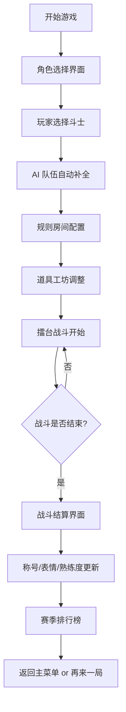

## 1. 产品概述

AI 大乱斗是一款本地多人围观或单人挑战的派对格斗游戏，玩家可操控各具性格的 AI 斗士在充满机关的擂台上进行热血对战，支持跳跃闪避、轻重攻击、道具抢夺、必杀释放等丰富玩法。

- 目标用户：喜欢派对游戏、格斗游戏、AI 策略游戏的玩家群体
- 产品价值：提供有趣的本地多人娱乐体验，展现 AI 智能体的协作与对抗策略

## 2. 核心功能

### 2.1 用户角色
| 角色 | 权限说明 |
|------|----------|
| 本地玩家 | 单人挑战 AI 队伍 / 本地多人轮流操作 |
| 围观观众 | 观看 AI 自动对战，暂停查看伤害统计 |

### 2.2 功能模块
1. **角色选择界面**：AI 性格斗士展示、玩家选人、AI 难度设置
2. **规则房间界面**：回合数设置、胜利条件、AI 激进/保守程度、擂台机关、随机道具开关、保存常用规则
3. **道具工坊界面**：道具列表展示、自定义道具出现频率、场景武器设置
4. **擂台地图界面**：实时战斗、跳跃闪避、轻重攻击、道具抢夺、必杀槽、AI 结盟与背刺、暂停伤害统计
5. **赛季排行榜界面**：角色胜率、称号系统、表情收集、角色熟练度展示

### 2.3 页面详情
| 页面名称 | 模块名称 | 功能描述 |
|----------|----------|----------|
| 角色选择 | 斗士展示区 | 展示 8 位 AI 性格斗士卡片，包含头像、名称、性格描述、属性值 |
| 角色选择 | 选人操作区 | 玩家 1/玩家 2 选择斗士，AI 队伍自动补全，确认开始 |
| 角色选择 | AI 难度设置 | 调节 AI 整体难度（简单/普通/困难），单人模式启用 |
| 规则房间 | 回合设置 | 设置战斗回合数（1/3/5），胜利条件（KO 次数/血量百分比/时间） |
| 规则房间 | AI 性格调节 | 滑块调节 AI 激进/保守程度，影响攻击频率与防御策略 |
| 规则房间 | 擂台机关 | 开关选择：地刺、弹簧、熔岩、落石、传送门 |
| 规则房间 | 道具设置 | 启用/禁用随机道具，保存当前规则为预设 |
| 道具工坊 | 道具列表 | 展示所有可用道具：治疗药水、力量增幅、速度靴、护盾、炸弹、烟雾弹 |
| 道具工坊 | 频率调节 | 每个道具独立设置出现频率（0-100%） |
| 道具工坊 | 场景武器 | 选择可掉落的场景武器：剑、锤、弓、盾牌、法杖 |
| 擂台地图 | 战斗区域 | Canvas 渲染的 2D 擂台，支持 2-4 人同屏对战 |
| 擂台地图 | HUD 状态栏 | 实时显示斗士血量、必杀槽、持有道具、回合信息 |
| 擂台地图 | 操作提示 | 键盘操作说明：WASD 移动、J 轻击、K 重击、L 闪避、空格跳跃 |
| 擂台地图 | AI 行为显示 | AI 结盟状态指示、背刺警告提示 |
| 擂台地图 | 暂停面板 | 暂停游戏、伤害统计表格、继续/退出选项 |
| 赛季排行榜 | 胜率排行 | 按角色胜率排序展示，胜场数、总场次、KDA |
| 赛季排行榜 | 称号系统 | 展示已获得称号，解锁条件进度 |
| 赛季排行榜 | 表情收集 | 展示战斗中可触发的表情解锁状态 |
| 赛季排行榜 | 熟练度 | 每个角色的熟练度等级与经验进度条 |

## 3. 核心流程

玩家进入游戏 → 选择角色 → 配置规则房间 → 调整道具工坊 → 进入擂台战斗 → 战斗结束查看结算 → 赛季排行榜更新

## 4. 用户界面设计

### 4.1 设计风格
- **主色调**：深紫 + 霓虹青 + 炽热橙，营造赛博朋克格斗氛围
- **辅助色**：血红（危险/攻击）、翠绿（治疗/增益）、金黄（必杀/胜利）
- **按钮风格**：霓虹发光边框，悬停时脉冲动画，3D 立体按压效果
- **字体选择**：标题使用 Orbitron（科幻格斗风），正文使用 ZCOOL KuaiLe（活泼中文）
- **布局风格**：卡片式布局，倾斜边框，不规则多边形，动态网格
- **图标风格**：像素复古风 emoji 结合矢量霓虹图标
- **动效风格**：粒子爆炸特效，屏幕震动，慢动作回放，拖尾残影

### 4.2 页面设计概览
| 页面名称 | 模块名称 | UI 元素 |
|----------|----------|----------|
| 角色选择 | 斗士卡片 | 倾斜霓虹边框卡片，头像发光，属性进度条动画，悬停 3D 翻转 |
| 角色选择 | 选人区 | 左右对战布局，中间 VS 霓虹标识，选中角色发光特效 |
| 规则房间 | 设置项 | 霓虹开关按钮，滑块带刻度发光，预设卡片保存按钮 |
| 道具工坊 | 道具卡片 | 网格布局，道具图标发光，频率滑块带数值显示 |
| 擂台地图 | 战斗场景 | Canvas 2D 渲染，擂台阴影纹理，机关动态发光，斗士像素精灵 |
| 擂台地图 | HUD | 顶部血条带渐变，必杀槽充能发光，道具图标显示在角色上方 |
| 擂台地图 | 暂停面板 | 毛玻璃半透明背景，伤害统计表格带霓虹边框 |
| 赛季排行榜 | 排行列表 | 前三名奖杯图标，每行带渐变背景，熟练度进度条发光 |

### 4.3 响应式
- 桌面端优先：1920×1080 设计稿，适配 1280×720 以上分辨率
- 触控优化：按钮最小触控区域 48px，移动端自动切换为触控操作
- 自适应布局：使用 CSS Grid + Flexbox，关键战斗区域保持等比例缩放

### 4.4 特效与动画指引
- **入场动画**：页面切换时粒子扩散转场，元素从四周飞入
- **战斗特效**：攻击时屏幕震动 + 闪光，必杀释放时慢动作 + 全屏闪光，被击时红色闪烁
- **UI 微交互**：按钮悬停放大 + 发光，滑块拖动实时反馈数值变化
- **背景动效**：全局噪点纹理叠加，擂台背景动态霓虹流光
