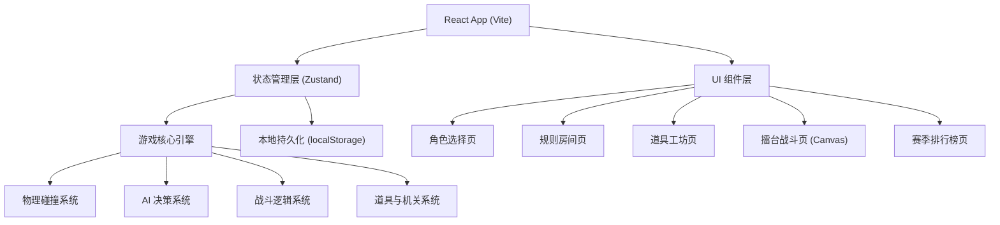

## 1. 架构设计



## 2. 技术说明

- **前端框架**：React@18 + TypeScript + Vite@5
- **样式方案**：TailwindCSS@3 + CSS Modules（关键组件）
- **状态管理**：Zustand（轻量级状态管理，适合游戏状态）
- **游戏渲染**：HTML5 Canvas 2D API（战斗场景）+ React DOM（UI层）
- **数据持久化**：localStorage（保存规则预设、排行榜、熟练度）
- **动画方案**：CSS Animations/Transitions + Canvas requestAnimationFrame
- **字体资源**：Google Fonts (Orbitron, ZCOOL KuaiLe)

## 3. 路由定义

| 路由路径 | 页面名称 | 说明 |
|----------|----------|------|
| / | 主菜单页 | 游戏入口，展示开始游戏、排行榜、设置按钮 |
| /select | 角色选择页 | 玩家选择斗士，配置 AI 难度 |
| /rules | 规则房间页 | 回合数、胜利条件、AI 性格、擂台机关设置 |
| /workshop | 道具工坊页 | 道具频率调节、场景武器设置 |
| /battle | 擂台战斗页 | Canvas 实时战斗主界面 |
| /ranking | 赛季排行榜页 | 胜率排行、称号、表情、熟练度展示 |

## 4. 数据模型

### 4.1 核心数据定义

```typescript
// 斗士定义
interface Fighter {
  id: string;
  name: string;
  avatar: string;
  personality: 'aggressive' | 'defensive' | 'balanced' | 'tricky' | 'loyal' | 'betrayer';
  personalityDesc: string;
  stats: {
    hp: number;
    attack: number;
    defense: number;
    speed: number;
    energy: number; // 必杀槽增长速度
  };
  specialName: string;
  specialDesc: string;
}

// 斗士战斗状态
interface FighterState {
  id: string;
  fighterId: string;
  isPlayer: boolean;
  team: number; // 0, 1, 2, 3
  position: { x: number; y: number };
  velocity: { x: number; y: number };
  hp: number;
  maxHp: number;
  energy: number;
  maxEnergy: number;
  facing: 'left' | 'right';
  state: 'idle' | 'walk' | 'jump' | 'attack_light' | 'attack_heavy' | 'dodge' | 'hurt' | 'ko' | 'special';
  stateTimer: number;
  invincible: boolean;
  invincibleTimer: number;
  heldItem: Item | null;
  heldWeapon: Weapon | null;
  buffs: Buff[];
  allies: string[]; // 结盟的斗士ID
  betrayalRisk: number; // 0-100 背刺风险
  damageDealt: number;
  damageTaken: number;
  kills: number;
  isAI: boolean;
  aiAggression: number; // 0-100 激进程度
}

// 道具定义
interface Item {
  id: string;
  name: string;
  icon: string;
  description: string;
  type: 'heal' | 'power' | 'speed' | 'shield' | 'bomb' | 'smoke';
  value: number;
  duration?: number;
  spawnRate: number; // 0-100
}

// 场景武器
interface Weapon {
  id: string;
  name: string;
  icon: string;
  damage: number;
  range: number;
  type: 'sword' | 'hammer' | 'bow' | 'shield' | 'staff';
}

// Buff/Debuff
interface Buff {
  id: string;
  type: 'power' | 'speed' | 'shield' | 'slow';
  value: number;
  duration: number;
  remainingTime: number;
}

// 擂台机关
interface ArenaTrap {
  id: string;
  name: string;
  icon: string;
  type: 'spike' | 'spring' | 'lava' | 'rock' | 'portal';
  enabled: boolean;
  position: { x: number; y: number };
  width: number;
  height: number;
  cooldown: number;
  currentCooldown: number;
  damage?: number;
}

// 游戏规则
interface GameRules {
  rounds: number;
  winCondition: 'ko' | 'hp' | 'time';
  winValue: number; // KO次数/血量百分比/秒数
  aiAggression: number; // 0-100 全局AI激进
  aiDifficulty: 'easy' | 'normal' | 'hard';
  traps: { [key: string]: boolean };
  randomItems: boolean;
  itemSpawnRate: number; // 0-100 全局道具生成率
  weaponSpawn: boolean;
  playerCount: number; // 2-4
}

// 规则预设
interface RulePreset {
  id: string;
  name: string;
  rules: GameRules;
  itemRates: { [itemId: string]: number };
  createdAt: number;
}

// 排行榜记录
interface RankingRecord {
  fighterId: string;
  wins: number;
  losses: number;
  totalDamage: number;
  kills: number;
  deaths: number;
}

// 称号
interface Title {
  id: string;
  name: string;
  description: string;
  icon: string;
  unlocked: boolean;
  condition: string;
  progress: number;
  target: number;
}

// 表情
interface Emote {
  id: string;
  name: string;
  icon: string;
  unlocked: boolean;
}

// 熟练度
interface Proficiency {
  fighterId: string;
  level: number;
  exp: number;
  expToNext: number;
}

// 游戏全局状态
interface GameState {
  screen: 'menu' | 'select' | 'rules' | 'workshop' | 'battle' | 'result' | 'ranking';
  selectedFighters: string[]; // 玩家选择的斗士ID
  rules: GameRules;
  presets: RulePreset[];
  rankings: RankingRecord[];
  titles: Title[];
  emotes: Emote[];
  proficiencies: Proficiency[];
  itemRates: { [itemId: string]: number };
  battleResult: BattleResult | null;
  isPaused: boolean;
}

interface BattleResult {
  winnerTeam: number;
  roundResults: RoundResult[];
  fighterStats: { [fighterId: string]: FighterBattleStats };
  newTitles: string[];
  newEmotes: string[];
  expGained: { [fighterId: string]: number };
}

interface RoundResult {
  round: number;
  winner: number;
  timeElapsed: number;
}

interface FighterBattleStats {
  damageDealt: number;
  damageTaken: number;
  kills: number;
  deaths: number;
  specialUsed: number;
  itemsUsed: number;
}
```

### 4.2 数据持久化

使用 localStorage 保存以下数据：
- `arena_presets`: 规则预设列表
- `arena_rankings`: 排行榜数据
- `arena_titles`: 称号解锁状态
- `arena_emotes`: 表情解锁状态
- `arena_proficiencies`: 角色熟练度
- `arena_item_rates`: 道具频率自定义设置

## 5. 核心系统设计

### 5.1 游戏引擎 (GameEngine)
- 基于 `requestAnimationFrame` 的游戏循环
- 固定步长物理更新 + 可变步长渲染
- 状态机管理：开始 → 倒计时 → 战斗 → 回合结算 → 结束
- 事件系统：攻击命中、道具拾取、机关触发、结盟/背刺

### 5.2 物理系统 (PhysicsSystem)
- AABB 碰撞检测（斗士、道具、机关、擂台边界）
- 重力与跳跃物理
- 击退与位移处理
- 平台/擂台边缘检测

### 5.3 AI 决策系统 (AISystem)
- 行为树架构：感知 → 评估 → 决策 → 执行
- 性格影响因子：aggressive 更倾向攻击，defensive 更倾向防御/道具
- 结盟机制：低血量时寻找盟友，共享敌人信息
- 背刺机制：高 betrayalRisk 的 AI 在有利时机攻击盟友
- 难度影响：hard AI 预测玩家动作，easy AI 反应延迟

### 5.4 战斗系统 (CombatSystem)
- 轻攻击（快速低伤害）、重攻击（慢速高伤害）、闪避（无敌帧）
- 必杀技：能量槽满后触发，全屏范围高伤害
- 伤害计算：攻击力 × 武器加成 × Buff 加成 - 防御力
- 受击反馈：硬直、击退、屏幕震动、闪光效果

### 5.5 道具与机关系统
- 定时在擂台随机位置生成道具
- 道具拾取自动触发或手动使用
- 机关周期性激活，造成伤害或特殊效果
- 场景武器：增加攻击伤害和范围

## 6. 项目目录结构

```
src/
├── components/
│   ├── layout/
│   │   ├── NeonButton.tsx
│   │   ├── NeonCard.tsx
│   │   └── GlowSlider.tsx
│   ├── fighter/
│   │   ├── FighterCard.tsx
│   │   ├── FighterSelect.tsx
│   │   └── FighterStats.tsx
│   ├── battle/
│   │   ├── BattleArena.tsx      # Canvas 战斗主组件
│   │   ├── BattleHUD.tsx
│   │   ├── HealthBar.tsx
│   │   ├── EnergyBar.tsx
│   │   └── PausePanel.tsx
│   ├── rules/
│   │   ├── RuleSection.tsx
│   │   ├── TrapToggle.tsx
│   │   └── PresetCard.tsx
│   ├── workshop/
│   │   ├── ItemCard.tsx
│   │   └── WeaponSelect.tsx
│   └── ranking/
│       ├── RankingRow.tsx
│       ├── TitleCard.tsx
│       └── ProficiencyBar.tsx
├── pages/
│   ├── MainMenu.tsx
│   ├── CharacterSelect.tsx
│   ├── RuleRoom.tsx
│   ├── ItemWorkshop.tsx
│   ├── BattleArena.tsx
│   └── SeasonRanking.tsx
├── engine/
│   ├── GameEngine.ts
│   ├── PhysicsSystem.ts
│   ├── AISystem.ts
│   ├── CombatSystem.ts
│   ├── ItemSystem.ts
│   ├── TrapSystem.ts
│   └── types.ts
├── store/
│   └── gameStore.ts
├── data/
│   ├── fighters.ts
│   ├── items.ts
│   ├── weapons.ts
│   ├── traps.ts
│   └── titles.ts
├── hooks/
│   ├── useGameLoop.ts
│   ├── useKeyboard.ts
│   └── useLocalStorage.ts
├── utils/
│   ├── math.ts
│   ├── collision.ts
│   └── storage.ts
├── styles/
│   ├── globals.css
│   └── animations.css
├── App.tsx
├── main.tsx
└── router.tsx
```
